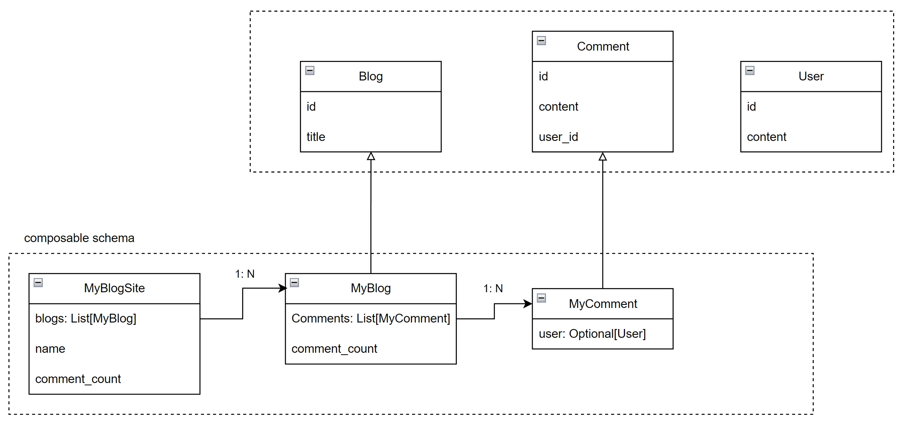

# pydantic-resolve-demo

- https://github.com/allmonday/pydantic-resolve
- https://github.com/allmonday/pydantic2-resolve

This repo shows how we define and compose schemas together with pydantic-resolve and sync schemas/methods to frontend with openapi-ts.

> GraphQL(dataloader and resolver) at backend schema and REST at API.




```python
class MyBlogSite(BaseModel):
    name: str
    # blogs: list[Blog] = []  # this will not include comments and comment_count
    blogs: list[MyBlog] = []
    async def resolve_blogs(self):
        return await get_blogs()

    comment_count: int = 0
    def post_comment_count(self):
        return sum([b.comment_count for b in self.blogs])
        
class MyBlog(Blog):
    # comments: list[Comment] = []  # this will not include user field
    comments: list[MyComment] = []
    def resolve_comments(self, loader=LoaderDepend(blog_to_comments_loader)):
        return loader.load(self.id)

    comment_count: int = 0
    def post_comment_count(self):
        return len(self.comments)

class MyComment(Comment):
    user: Optional[User] = None
    def resolve_user(self, loader=LoaderDepend(user_loader)):
        return loader.load(self.user_id)

```

We only need to make sure the return value from `resolve_blogs` or `resolve_comments` can be converted to BASE schemas (Blog, Comment)

then we can replace `blogs: list[Blog] = []` to `blogs: list[MyBlog] = []` to extend more fields.

## BE

```shell
pip install -r requirement.pip
fastapi dev main.py
```

```python
@app.get("/my-site/{name}", response_model=MyBlogSite, tags=["main"])
async def read_my_site(name: str):
    site = MyBlogSite(name=name)
    return await Resolver().resolve(site)
```

visit http://localhost:8000/docs#/main/read_my_site


## FE

ensure server is running, and then generate the client from `localhost:8000/openapi.json`
```shell
cd fe
npm install
npm run openapi-ts
npx ts-node main.ts
```

```ts
mport { MainService } from './src/client'

type MySite = Awaited<ReturnType<typeof MainService.readMySite>>
type Param = Parameters<typeof MainService.readMySite>[0]


(async () => {
    const name: Param['name'] = 'tangkikodo'
    const data: MySite = await MainService.readMySite({ name: name })
    console.log(JSON.stringify(data, null, 2))
})()
```

inspect the log output
